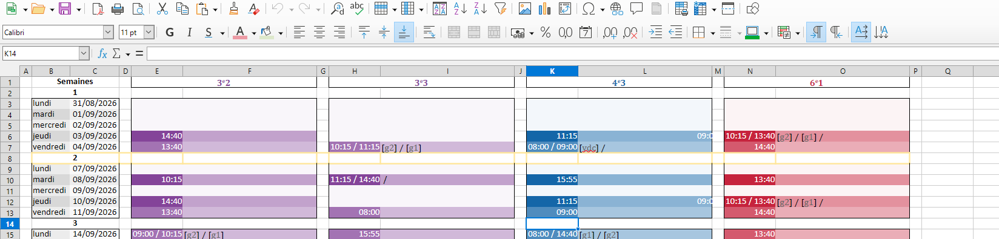
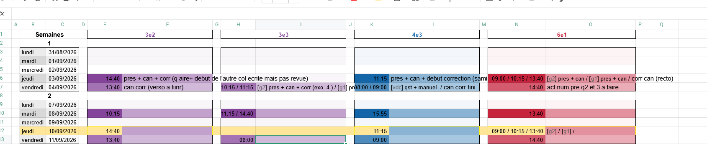
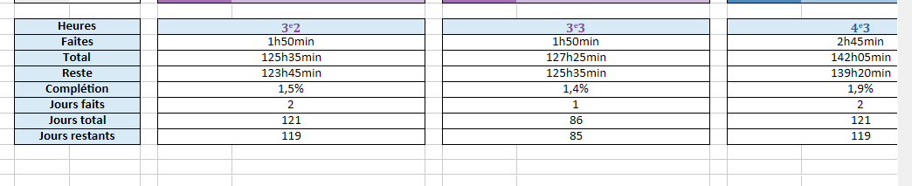

laisse la colonne des semaines en higliht plein pas seulement le contour; ainsi que les case entre les classe et les cases indiquant l'horaire

ne doivent etre uniqument encadrée que les cases necessitant d'etre remplie

c'est a dire que pour un weekend on devrait avoir un highlight de background full car aucune case ne devra etre remplie

mais pour le jeudi 10 par exemple

il y'a trois cases dont seul les edges sont colorés

et les 3e3 n'ont pas cours donc leur case est full highlight

---

ajoute un espace entre le tableau des heures restantes et jours

et remet une case entete Jours
puis une case faits
total et restant